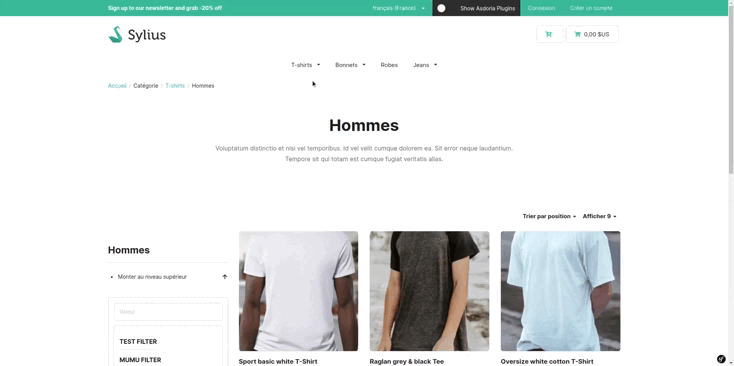

<p align="center">
</p>


<h1 align="center">Asdoria Locale Switcher Plugin</h1>

<p align="center">This plugin allows you to change locale in sylius shop while keeping the page you are on. </p>

## Features

+ Change the locale of the store and don't redirect to home.



## Installation

1. run `composer require asdoria/sylius-locale-switcher-plugin`
2. Add the bundle in `config/bundles.php`. You must put the  LocaleSwitcher Plugin line ABOVE TwigBundle

```PHP
Asdoria\SyliusLocaleSwitcherPlugin\AsdoriaSyliusLocaleSwitcherPlugin::class => ['all' => true],
[...]
Symfony\Bundle\TwigBundle\TwigBundle::class => ['all' => true],
```
3. Import config in `config/packages/_sylius.yaml`
```yaml
imports:
    - { resource: "@AsdoriaSyliusLocaleSwitcherPlugin/Resources/config/config.yaml"}
```

4. Copy the template overrides from the bundle directory
 
 ```
From: [shop_dir] vendor/asdoria/sylius-locale-switcher-plugin/src/Resources/views/bundles/SyliusShopBundle/*
To: [shop_dir] templates/bundles/SyliusShopBundle/*
 ```

